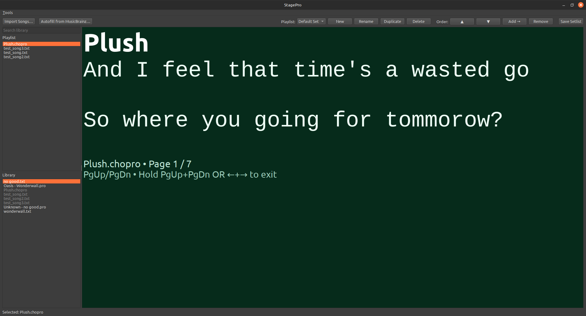
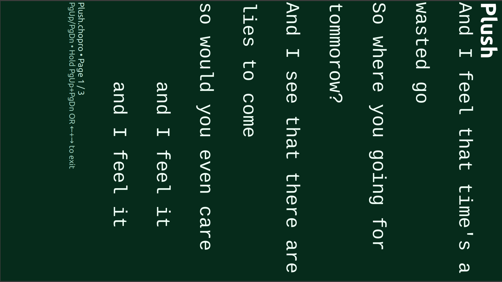
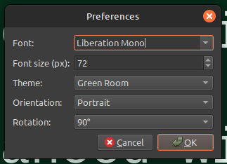

<div align="center">
  
</div>

# 🎤 StagePro

**StagePro** is a cross-platform, musician-focused lyrics and chord prompter designed for **live performance**.  
It is built around **ChordPro** song files, supports **foot-switch control**, and cleanly separates **on-stage use** from **setlist and library management**.

StagePro is designed to run reliably on laptops, mini PCs, and dedicated **portrait-oriented stage wedges** — even **offline at a gig**.

---

## 📸 Screenshots





---

## ✨ Key Features

### 🎶 Performance-First Design
- Dedicated **On-Stage Mode** (true fullscreen, distraction-free)
- **Maintenance Mode** for managing songs, playlists, and metadata
- Optimized for **portrait-first** stage displays
- Reliable behavior on **rotated monitors**
- Works fully **offline**

### 📄 ChordPro Native
- Uses standard `.cho` / ChordPro song files
- Automatic parsing of lyrics, chords, sections, and directives
- Graceful handling of minimally formatted or malformed files

### 🎛️ Configurable Display
- Customizable **font family**
- Adjustable **font size**
- Theme-based color system (JSON theme files)
- Screen **rotation support** (90° / 180° / 270°)
- Portrait & landscape orientation support
- Correct word wrapping and pagination on rotated displays

### 🎨 Theme System
- Theme files stored as JSON
- Per-element color control (lyrics, chords, chorus, headers, etc.)
- User-selectable themes via **Preferences UI**
- No restart required — updates apply immediately

### 📚 Library & Playlist Management
- Central song library
- Multiple playlists (setlists)
- Add/remove/reorder songs without duplicating files
- Safe handling of missing or moved files

### 🦶 Footswitch & Keyboard Control
- Page navigation
- Song navigation
- Mode switching (Maintenance ↔ On-Stage)
- Designed for USB foot pedals and keyboard shortcuts

### 🧠 Smart Metadata
- Optional **MusicBrainz** integration for metadata autofill
- Non-destructive updates to song files

### 🌐 Experimental Online Import
- Optional **Ultimate Guitar** search/import flow in Maintenance Mode
- Use **Ctrl+G** (or **Edit → Search Ultimate Guitar…**) to open a unified UG import dialog
- Search, click a result to load **ChordPro preview**, then import exactly that previewed content
- Optional **Remove all chord annotations** toggle in the UG import dialog strips inline chord tags (e.g. `[C]`, `[Am7]`) and drops chord-only rows in both preview and final import
- Imports selected UG tab content into local `.pro` files
- Best-effort parser (depends on publicly accessible UG page structure; may break if UG changes)
- Can be disabled in config via `integrations.ultimate_guitar.enabled`

---

## 🛠️ Preferences UI

StagePro includes a built-in **Preferences** window so you never have to edit JSON by hand.

From **Tools → Preferences…**, you can configure:

- Font family
- Font size
- Active theme
- Orientation (portrait / landscape)
- Rotation (90° / 180° / 270°)

Changes apply **immediately**.

---

## 🆕 What’s New in v1.1.0

### 🎯 Portrait-First Layout Improvements
- Maintenance mode UI redesigned to work correctly on **rotated and portrait displays**
- Window resizing and maximize behavior now works reliably across Linux desktop environments (including XFCE)
- On-stage rendering now uses **logical layout dimensions**, fixing word wrapping on rotated monitors

### 🪟 Cross-Platform Window Behavior Fixes
- Proper separation between Maintenance and On-Stage sizing logic
- No hidden fullscreen constraints affecting window resizing
- Improved compatibility with mini PCs and dedicated stage displays

### 📦 Smaller Windows Builds
- Windows packaging optimized — dramatically reduced installer size
- Only required Qt components are bundled

---

## 💻 Supported Platforms

StagePro is built and tested on:

- 🐧 **Linux** (AppImage)
- 🪟 **Windows**
- 🍎 **macOS**

> 📱 **Android support is planned** (touch-friendly on-stage mode).

---

## 📦 Installation

### Linux (Recommended)
Download the `.AppImage`, make it executable, and run:
```bash
chmod +x StagePro-*.AppImage
./StagePro-*.AppImage
```

### Windows
Download the Windows build and run `StagePro.exe`.

### macOS
Download the `.app` bundle or zip, extract, and launch.

---

## 🧪 Building From Source

### Requirements
- Python 3.11+
- PySide6
- PyInstaller (for packaging)

### Clone & Run
```bash
git clone https://github.com/iampaulmata/StagePro.git
cd StagePro
python -m venv .venv
source .venv/bin/activate   # or .venv\Scripts\activate on Windows
pip install -r requirements.txt
python stagepro.py
```

### Packaging
Platform-specific build scripts/spec files are included for:
- Linux AppImage
- Windows executable
- macOS app bundle

---

## 📁 File Structure (Overview)

```
stagepro/
├── stagepro/
│   ├── ui_main.py
│   ├── config.py
│   ├── render.py
│   ├── paginate.py
│   └── ...
├── themes/
│   ├── blueroom.json
│   ├── greenroom.json
│   └── ...
├── songs/
│   └── *.cho
├── packaging/
│   └── build scripts
└── README.md
```

---

## 🎯 Philosophy

StagePro is intentionally:
- **Offline-first**
- **Performance-focused**
- **Readable at a glance**
- **Predictable under pressure**

No cloud dependency. No account required. No surprises mid-set.

---

## 📜 License

MIT License  
See `LICENSE` for details.

---

## 🙌 Credits & Contributions

StagePro is actively developed and open to contributions.

Bug reports, feature requests, and pull requests are welcome.
